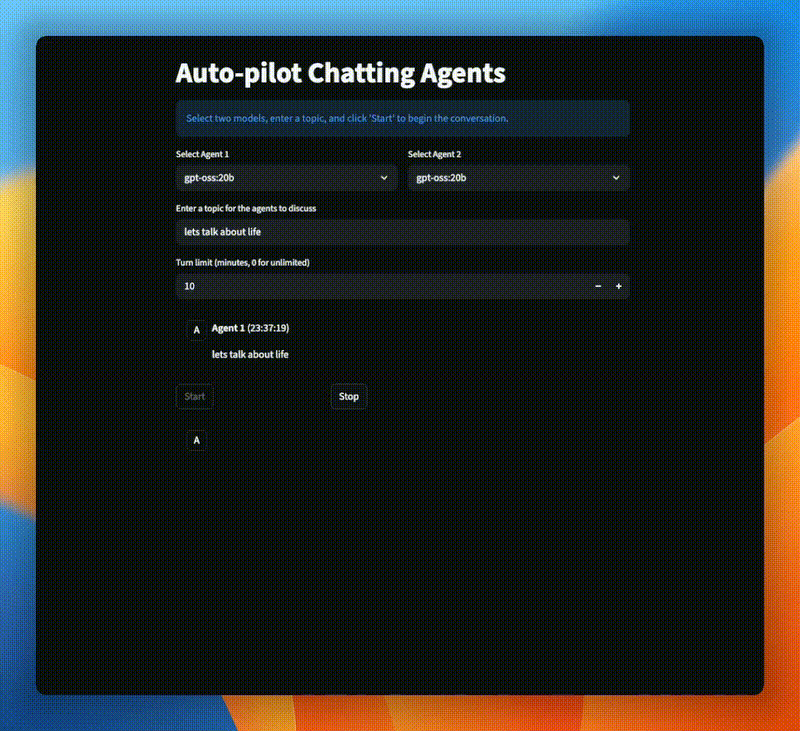

# Auto-pilot Chatting Agents

This is a Streamlit application that allows two local Ollama models to chat with each other.

## Features

- **Model Selection**: Choose two different Ollama models to act as agents.
- **Conversation Control**: Start and stop the conversation at any time.
- **Real-time Streaming**: See the conversation unfold in real-time.
- **Save Chat**: Download the entire conversation as a Markdown file.




## How to run the app

1. Make sure you have Python and Streamlit installed.
2. Install the required libraries:
   ```bash
   pip install streamlit requests
   ```
3. Run the app:
   ```bash
   streamlit run app.py
   ```
